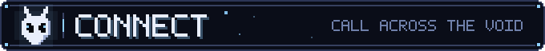
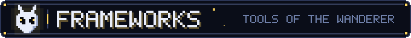
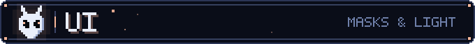
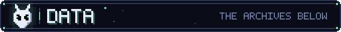
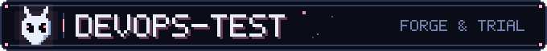
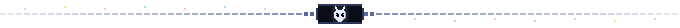

  

<pre>
⣿⣿⡿⠁⠀⠀⠀⠀⠀⠀⠀⠀⠀⠀⠀⠀⠀⠀⠀⠀⠀⠀⠀⠀⠀⠀⠀⠀⠀⠀⠀⠀⠀⠀⠀⠀⠀⠀⠀⠀⠀⠀⠀⠀⠀⢦⣬⣿⣿⣿
⣵⡿⠀⠀⠀⠀⠀⠀⠀⠀⠀⠀⠀⠀⠀⠀⠀⠀⠀⠀⠀⠀⠀⠘⠃⠀⠀⠀⡐⣹⢋⣾⢻⣸⡀⠀⠀⣰⢀⡀⠀⠀⠀⠀⠀⠀⠀⠘⣿⣿
⣿⠁⠀⠀⠀⠀⠀⠀⠀⠀⠀⠀⠀⠀⠀⠀⠀⠀⠀⠀⠀⠀⠀⠀⠀⠀⠀⠀⠀⠋⠈⠀⡼⠃⠀⠀⢰⡍⠈⠻⠀⠀⠀⠀⣀⣠⣀⡀⠘⣿
⡿⠀⠀⠀⠀⠀⠀⠀⠀⠀⠀⠀⢀⠀⠀⠀⠀⠀⠀⠀⠀⠀⠀⠀⠀⠀⠀⠀⠀⠀⠀⠀⠀⠀⠀⠀⠀⠀⠀⠀⠀⠀⢠⣾⣿⣿⣿⣿⣦⠹
⡇⠀⡀⠀⠀⠀⠀⢠⠀⠀⠀⢀⡎⠀⠀⠀⠀⠀⣠⠀⠀⠀⠀⠀⠀⠀⠀⠀⠀⠀⠀⠀⠀⠀⠀⠀⠀⠈⠉⢻⡷⠆⣿⣿⣿⣿⣿⣿⣿⡇
⣧⣼⠀⠀⠀⠀⠀⣾⠀⠀⠀⣾⣇⠀⠀⠀⠀⣰⡏⠀⠀⠀⠀⠀⣠⡇⠀⠀⠀⠀⠀⠀⠀⠀⠀⠀⠀⠀⠀⠈⣄⠀⠘⢿⣿⣿⣿⣿⡟⣤
⣿⣿⠀⢠⠀⠀⢠⣯⡀⠀⣰⣿⣿⠀⡄⠀⣼⣿⡇⠀⠀⠀⠀⣰⣿⡇⠀⡀⢰⡄⠀⠀⠀⠀⠀⠀⠀⠀⠐⣄⠋⡀⣾⠀⠉⠛⠉⠁⠀⣿
⣿⣿⠀⠚⠀⠀⠸⣿⣧⢰⣬⡛⢿⣧⣧⣸⣿⣿⣧⠀⠀⠀⣴⣿⣿⡇⢠⣧⣿⠀⠀⠀⠀⠀⠀⠀⠀⠀⠀⠌⣠⣧⠁⠀⠀⠀⠀⠀⠀⣿
⣿⣿⡄⡟⣿⠀⣆⢠⣀⠈⠭⣛⠦⡈⢻⣿⣿⣿⣿⡇⣤⣾⣿⣿⣿⡇⣾⣿⣿⡀⠀⠀⢠⠀⠀⠀⠀⠀⠀⢸⡿⠏⠀⠀⠀⠀⠀⠀⢰⣿
⣿⣿⣷⣦⠻⡇⢹⣧⡹⠄⣦⡌⠑⢤⠀⢿⣿⣿⣿⣤⣤⣤⣤⣴⣶⣶⣶⣶⣶⣶⡆⢀⣿⡄⠀⠀⠀⠀⠀⠀⠀⠀⠀⠀⠀⠀⠀⢀⣾⣿
⣿⣿⣿⣿⣷⡌⠘⣿⣿⣦⣬⣥⣸⣼⡎⣬⣛⠛⡍⣭⣄⣀⣀⢀⣒⣂⡉⠉⠛⠿⠇⣾⣿⠇⠀⠀⠀⠀⠀⠀⠀⠀⠀⠀⠀⠀⢀⣿⡿⠏
⣿⣿⣿⣿⣿⣇⡐⣦⣝⡻⢿⣿⣿⣿⠁⣰⣎⢻⣸⣿⣿⣯⣙⠈⠿⠿⠣⠾⣂⣤⠠⡍⡅⣠⣼⠀⠀⠀⡴⠛⢆⠀⠀⠀⠀⠀⣸⣿⠛⠻
⣿⣿⣿⣿⣿⣿⡇⣿⣿⣿⣿⣶⣶⡶⢠⣿⣿⣧⣁⢿⣿⣿⣿⣿⣿⣿⣿⣿⣿⡿⡱⢛⣃⠋⠀⢀⠇⣀⣘⡄⣸⠀⠀⠀⠀⢠⣿⠟⠀⠀
⣿⣿⣿⣿⣿⣿⣇⢹⣿⣿⣿⣿⣿⡀⢿⣿⣿⣿⣿⣷⣮⣝⡻⠿⠿⠿⠿⢟⣋⣤⣾⣿⣿⠀⢀⣾⠆⡀⣿⠏⠁⠀⠀⠀⣰⣿⣿⡄⠀⠀
⣿⣿⣿⣿⣿⣿⣿⡘⣿⣿⣿⣿⣿⣿⣮⣿⣿⣿⣿⣿⣿⣿⣿⣿⣿⣿⣿⣿⣿⣿⣿⣿⣿⡇⣼⡃⠨⣲⠅⠀⠀⢀⠌⣱⠿⣿⣿⡿⡄⠀
⣿⣿⣿⣿⣿⣿⣿⣷⡹⣿⣿⣿⣿⣿⣿⣿⣿⣿⣿⣿⣿⣿⣿⣿⣿⣿⣿⣿⣿⣿⣿⣿⣿⣴⠛⠿⠟⠁⠀⠀⢀⣾⠾⠁⠀⠹⣿⣷⡹⣆
⣿⣿⣿⣿⣿⣿⣿⣿⣷⡜⢿⣿⣿⣯⣙⣛⠿⢿⣿⣿⣿⣿⣿⣿⣿⣿⣿⣿⣿⣿⣿⣿⢟⡁⠀⠀⠀⠀⠀⠀⡾⠿⠤⠄⠠⠀⠈⠿⠷⢘
⣛⣻⣿⣿⣿⣟⣛⣻⣿⣿⣎⢿⣿⣿⣷⣭⣝⣲⣭⣿⣿⣿⣿⣿⣿⣿⣿⣿⣿⣿⠟⣱⣿⡇⢠⠀⠀⠀⡀⠰⢿⣿⢡⣤⣾⡿⠿⠿⢷⣿
⣿⣿⣿⣿⣯⣭⣟⣛⣛⣻⡛⣧⠻⣿⣿⣿⣿⣿⣿⣿⣿⣿⣿⣿⣿⣿⡿⠟⣫⣴⣿⣿⣿⣷⣼⡄⢠⠀⣀⣴⣦⠹⣴⣶⣶⣿⣿⣟⣻⣟
⣿⣿⣿⣿⣿⣿⣿⣿⣿⣿⣿⡘⣷⡙⣿⣿⣿⣿⣿⣿⣿⣿⡿⠟⠋⠁⢀⣾⣿⣿⣿⣿⣿⣿⡿⢛⣴⣾⣿⣿⣿⣷⣜⢿⣿⣿⡿⠿⠿⠿
</pre>

<pre>
╔════════════════════════════════════════════════════════════════════╗
║                                                                    ║
║             ░▒▓█  R O S H A N   A D H I K A R I  █▓▒░              ║
║                                                                    ║
╠════════════════════════════════════════════════════════════════════╣
║                                                                    ║
║  » ROLE ....... Full Stack Developer                               ║
║  » BASE ....... Nepal                                              ║
║  » MAIL ....... roshanadhikari66666@gmail.com                      ║
║  » STACK ...... web · mobile · desktop · tui · backend · devops    ║
║                                                                    ║
╠════════════════════════════════════════════════════════════════════╣
║                  ░▒▓  P R E S S   S T A R T  ▓▒░                   ║
╚════════════════════════════════════════════════════════════════════╝
</pre>

